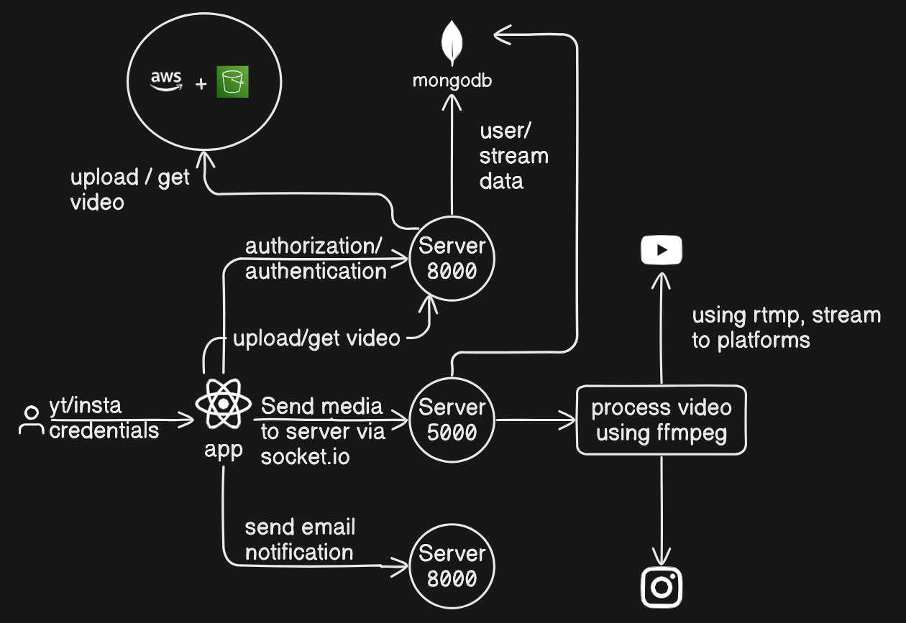
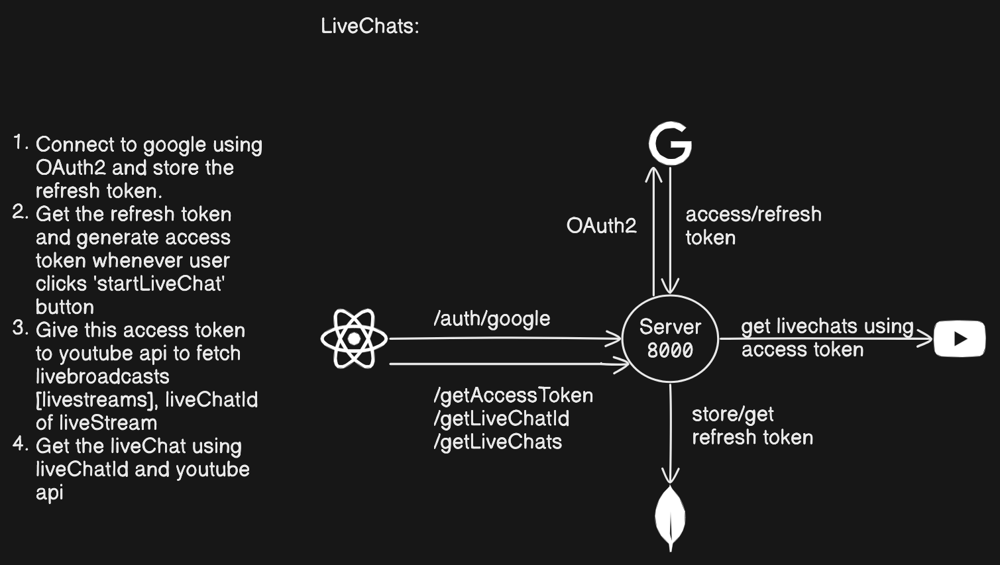

# StreamX

StreamX is a web application built with the MERN (MongoDB, Express, React, Node.js) Stack for streaming on multiple platforms, currently limited to YouTube and Instagram. It also allows uploading videos to AWS S3. The application features user authentication, live chat, email notifications for livestreams, and utilizes a microservice architecture.

## Features

- **Multi-Platform Streaming**: Stream live on YouTube and Instagram using the RTMP protocol.
- **Video Upload**: Upload videos directly to AWS S3.
- **User Authentication**: Sign up and log in securely.
- **Live Chat**: Engage with viewers in real-time.
- **Email Notifications**: Send notification emails for upcoming livestreams.
- **Microservice Architecture**: Separate servers for livestreaming and user management.

## Tech Stack

- **Frontend**: React.js
- **Backend**: Node.js, Express.js
- **Database**: MongoDB
- **Cloud Storage**: AWS S3
- **Streaming Services**: RTMP protocol (YouTube, Instagram)
- **Email Service**: Nodemailer (or similar)
- **Authentication**: JWT, Passport.js (or similar)

## Installation

1. **Clone the repository:**

    ```bash
    git clone https://github.com/KunalAsatkar/streamerx
    cd streamx
    ```

2. **Install dependencies for the backend and frontend:**

    ```bash
    cd server
    npm install
    cd ../ioserver
    npm install
    cd ../client
    npm install
    ```

3. **Set up environment variables:**

    Create a `.env` file in the `server` directory and add the following variables:

    ```plaintext
    MONGO_URL=your_mongo_connection_string
    SECRET=your_jwt_secret
    AWS_ACCESS_KEY_ID=your_aws_access_key
    AWS_SECRET_ACCESS_KEY=your_aws_secret_key
    AWS_BUCKET_NAME=your_s3_bucket_name
    EMAIL_SERVICE=your_email_service
    EMAIL_PORT=email_service_port
    MAILER_USER=your_email_user
    MAILER_PASSWORD=your_email_password
    GOOGLE_CLI_ID=your_google_client_id
    GOOGLE_CLI_SEC=your_google_client_secret
    EXPRESS_SESSION_SECRET=your_express_session_secret
    ```

4. **Run the backend and frontend servers:**

    ```bash
    # In the backend(server) directory
    npm start
    # In the backend(ioserver) directory
    npm start

    # In the frontend directory
    npm run dev
    ```

## Usage

1. **Sign up or log in** to the application.
2. **Connect your YouTube and Instagram accounts** by OAuth2.
3. **Upload videos** to AWS S3 via the upload section.
4. **Send email notifications** for your upcoming livestreams to your subscribers.
5. **Engage with your audience** using the live chat feature during streams.

## Microservices

StreamX uses a microservice architecture to handle different functionalities:

1. **Livestreaming Service**: Handles live streaming to multiple platforms using the RTMP protocol.
2. **User Management Service**: Manages user authentication, authorization, live chats, emails, and video uploads.

### Overall Architecture


### Live Chat Architecture



## Contributing

We welcome contributions to StreamX! Please follow these steps to contribute:

1. Fork the repository.
2. Create a new branch (`git checkout -b feature-branch`).
3. Commit your changes (`git commit -am 'Add new feature'`).
4. Push to the branch (`git push origin feature-branch`).
5. Create a new Pull Request.

## License

This project is licensed under the MIT License. See the [LICENSE](LICENSE) file for details.

## Contact

For any inquiries or issues, please contact [your-email@example.com](mailto:your-email@example.com).

---

Thank you for using StreamX!
